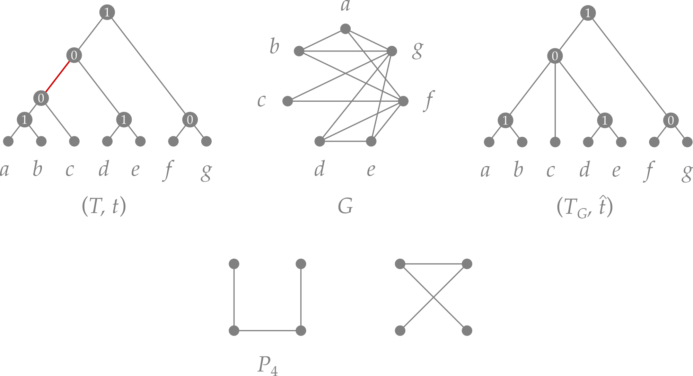

# Cographs

## Background

### Definition

**Cographs** (short for *complement-reducible graphs*) are a well-studied class of undirected
graphs built from single-vertex graphs by recursive application of two operations:

- the **disjoint union** $G = H \mathbin{\dot\cup} H'$, and
- the **join** $G = H \Join H'$, which is the disjoint union plus all edges between $H$ and $H'$.

Formally, a graph $G$ is a cograph if

1. $G$ is a single vertex $K_1$,
2. $G = H \mathbin{\dot\cup} H'$ is the disjoint union of two cographs $H$ and $H'$, or
3. $G = H \Join H'$ is the join of two cographs $H$ and $H'$.

An equivalent, and often more useful, characterisation is that cographs are exactly the
**$P_4$-free** graphs, i.e., graphs that contain no induced path on four vertices.  Further
equivalent conditions include: every connected induced subgraph has diameter at most 2, and every
induced subgraph is itself a cograph (the class is hereditary).


### Cotree representation

The recursive construction uniquely defines a rooted tree $(T, t)$ called the **cotree**, where

- the **leaves** of $T$ are the vertices of the cograph $G$, and
- each **inner vertex** $u$ carries a label $t(u) \in \{\texttt{parallel},\texttt{series}\}$
  indicating whether the children of $u$ are combined by disjoint union ($\texttt{parallel}$) or by
  join ($\texttt{series}$).

The edge set of $G$ is completely determined by the cotree $(T, t)$: two vertices $x$ and $y$ are
adjacent if and only if

$$
t\!\left(\operatorname{lca}_T(x, y)\right) = \texttt{series}.
$$

The cograph $G[u]$ represented by the subtree rooted at $u$ is given recursively by

$$
G[u] = \begin{cases}
  \displaystyle\mathop{\dot\bigcup}_{v \in \operatorname{child}(u)} G[v] & \text{if } t(u) = \texttt{parallel}, \\[6pt]
  \displaystyle\bigvee_{v \in \operatorname{child}(u)} G[v]               & \text{if } t(u) = \texttt{series}, \\[6pt]
  (\{u\}, \emptyset)                                                       & \text{if } u \text{ is a leaf.}
\end{cases}
$$

Because both operations are associative, the cotree is not necessarily binary.  Contracting all
inner edges $uv$ with $t(u) = t(v)$ yields the **discriminating cotree** $(T_G, \hat{t})$, which
is uniquely determined by $G$.



*Top row: Example for a cograph $G$ and a corresponding cotree $(T,t)$, where $\texttt{parallel}=0$
and $\texttt{series}=1$. The unique discriminating cotree $(T_G,\hat{t})$ is obtained from $(T,t)$
by contraction of the edge that is highlighted in red. 
Bottom row: The $P_4$ is the characteristic forbidden induced subgraph of cographs. Its complement
(drawn on the r.h.s.) is again a $P_4$.*

In `tralda`, inner vertices of a cotree are labeled with the strings `"series"` and `"parallel"`;
leaf labels hold the corresponding vertex identifiers of the cograph.


## Module overview

All cograph functionality is provided by `tralda.cograph`:

```python
from tralda.cograph import (
    # cotree ↔ graph conversion
    to_cograph, to_cotree,
    # cotree manipulation
    complement_cograph, random_cotree,
    # optimisation on cographs
    cluster_deletion, complete_multipartite_completion,
    # editing
    edit_to_cograph, CographEditor,
)
```

| Function / class | Input | Complexity | Notes |
|---|---|---|---|
| `to_cotree` | graph | $O(\lvert V\rvert + \lvert E\rvert)$ | returns `None` if not a cograph |
| `to_cograph` | cotree | $O(\lvert V\rvert^2)$ in the worst case | reconstructs the graph |
| `complement_cograph` | cotree | $O(\lvert V\rvert)$ | swaps `"series"` / `"parallel"` labels |
| `random_cotree` | $n$ | $O(n)$ | generates a uniformly random cotree |
| `cluster_deletion` | cograph or cotree | $O(\lvert V\rvert + \lvert E\rvert)$ | optimal partition into cliques |
| `complete_multipartite_completion` | cograph or cotree | $O(\lvert V\rvert + \lvert E\rvert)$ | optimal completion to a complete multipartite graph |
| `edit_to_cograph` | graph | $O(\lvert V\rvert^2)$ | heuristic; runs `CographEditor` |
| `CographEditor` | graph | $O(\lvert V\rvert^2)$ per run | class-based interface for editing |


## Detection and cotree construction

`to_cotree()` checks whether a graph is a cograph and, if so, returns its cotree.  The algorithm
is the linear-time recognition procedure of Corneil, Perl & Stewart (1985).

```python
import networkx as nx
from tralda.cograph import to_cotree

# a cograph: complete bipartite graph K_{2,3}
G = nx.complete_bipartite_graph(2, 3)
cotree = to_cotree(G)

if cotree is not None:
    cotree.print_tree()
else:
    print("G is not a cograph")
```

The inverse direction reconstructs the cograph from a cotree:

```python
from tralda.cograph import to_cograph, random_cotree

cotree = random_cotree(8, force_series_root=True)  # connected cograph on 8 vertices
G = to_cograph(cotree)
print(G.edges())
```

!!! note "References"
    D. G. Corneil, Y. Perl, and L. K. Stewart. A Linear Recognition Algorithm for Cographs.
    In: *SIAM J. Comput.*, 14(4), 926–934 (1985).
    [DOI: 10.1137/0214065](https://doi.org/10.1137/0214065)


## Cotree manipulation

### Complement

The complement $\overline{G}$ of a cograph is again a cograph.  Its cotree is obtained by
swapping all `"series"` and `"parallel"` labels:

```python
from tralda.cograph import to_cotree, complement_cograph, to_cograph

cotree = to_cotree(G)
compl_cotree = complement_cograph(cotree)            # returns a new cotree
complement_cograph(cotree, inplace=True)             # modifies cotree in-place
```

## Optimisation on cographs

Both optimisation problems below run in linear time given either the graph or its cotree as input.
If the graph is supplied, `to_cotree()` is called internally.

### Cluster deletion

The **cluster deletion** problem asks for a minimum-weight set of edges whose removal turns the
graph into a cluster graph (a disjoint union of cliques).  For cographs this can be solved exactly
in linear time (Gao, Hare & Nastos 2013).

`cluster_deletion()` returns a partition of the vertex set into sublists, where each sublist
corresponds to a clique in the optimal solution:

```python
from tralda.cograph import cluster_deletion, random_cotree, to_cograph

cotree = random_cotree(12, force_series_root=True)
G = to_cograph(cotree)

partition = cluster_deletion(G)       # accepts a graph …
partition = cluster_deletion(cotree)  # … or a cotree directly
print(partition)  # e.g. [[0, 3, 7], [1, 5], [2, 4, 6, 8, 9, 10, 11]]
```

!!! note "References"
    Yong Gao, Donovan R. Hare, James Nastos (2013) The cluster deletion problem for cographs.
    *Discrete Math* 313(23):2763–2771.
    [DOI: 10.1016/j.disc.2013.08.017](https://doi.org/10.1016/j.disc.2013.08.017)

### Complete multipartite graph completion

The **complete multipartite completion** problem asks for a minimum-weight set of edges whose
addition turns the graph into a complete multipartite graph.  For cographs this is also solvable
in linear time (it is equivalent to cluster deletion on the complement).

`complete_multipartite_completion()` returns a partition of the vertex set into sublists
corresponding to the independent sets of the optimal solution.  Passing `supply_graph=True`
additionally returns the completed graph as a `networkx.Graph`:

```python
from tralda.cograph import complete_multipartite_completion

partition = complete_multipartite_completion(G)
partition, H = complete_multipartite_completion(G, supply_graph=True)
print(partition)  # independent sets of the complete multipartite graph
```


## Cograph editing

**Cograph editing** asks for a minimum-cardinality symmetric edge difference that turns an
arbitrary graph into a cograph.  The problem is NP-hard in general; `tralda` provides the
heuristic of Crespelle (2021), which runs in $O(\lvert V\rvert^2)$.

`edit_to_cograph()` runs the heuristic for a configurable number of independent trials (each
starting from a random vertex permutation) and returns the cograph with the smallest edit
distance found:

```python
import networkx as nx
from tralda.cograph import edit_to_cograph

G = nx.petersen_graph()
H = edit_to_cograph(G, run_number=20)  # best result over 20 independent runs
```

For direct access to intermediate results — including the edited cotrees and per-run costs — use
`CographEditor` directly:

```python
from tralda.cograph import CographEditor, to_cograph

editor = CographEditor(G)
best_cotree = editor.cograph_edit(run_number=10)

print("best edit cost:", editor.best_cost)
print("all run costs:", editor.costs)

H = to_cograph(best_cotree)
```

!!! note
    Each call to `cograph_edit()` appends results to `editor.cotrees` and `editor.costs`.
    Construct a fresh `CographEditor` instance to start a clean run.

!!! note "References"
    Christophe Crespelle (2021). Linear-Time Minimal Cograph Editing.
    In: Bampis E., Pagourtzis A. (eds) *Fundamentals of Computation Theory*. FCT 2021.
    Lecture Notes in Computer Science, vol 12867. Springer, Cham.
    [DOI: 10.1007/978-3-030-86593-1_12](https://doi.org/10.1007/978-3-030-86593-1_12)
