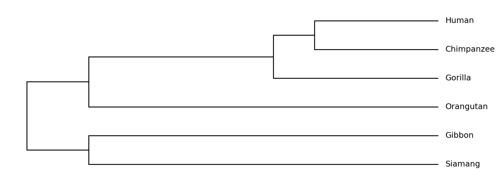

# Visualization

`tralda.visualization` draws `Tree` objects (see [Trees](trees.md)) as publication-ready figures
or interactive plots.  It ships two independent backends — [matplotlib](https://matplotlib.org/)
for static figures and [Plotly](https://plotly.com/python/) for interactive HTML — behind a shared
layout and styling API, so the same tree and styling logic can be rendered with either one.

This page is a quick start. For the full styling and layout API see
[Layout & Styling](visualization_styling.md); for two complete worked examples (a real
phylogeny and a simulated dataset) see [Examples](visualization_examples.md).


## Installation

The renderers are optional extras and are not installed by default:

```bash
pip install tralda[matplotlib]   # static figures
pip install tralda[plotly]       # interactive HTML / static image export
pip install tralda[viz]          # both
```

Importing `tralda.visualization` itself never requires either package — the renderer classes are
imported lazily on first use, so you only need the backend(s) you actually use.


## The one-liner: `plot_tree`

For the common case, [`plot_tree`][tralda.visualization.plot_tree] lays out and renders a tree in
a single call:

```python
from tralda.datastructures import Tree
from tralda.visualization import plot_tree

T = Tree.parse_newick(
    "((((Human:6,Chimpanzee:6)HC:2,Gorilla:8)HCG:9,Orangutan:17)Hominidae:3,"
    "(Gibbon:17,Siamang:17)Hylobatidae:3)Hominoidea;"
)

fig, ax = plot_tree(T)  # set show_internal_labels=True to display internal node labels
fig.savefig("tree.png")
```



*(Branch lengths above are illustrative divergence times, not scientifically exact.)*

Pass `backend="plotly"` to get an interactive figure instead, and `path=...` /
`show=True` to save and/or immediately display the result:

```python
plot_tree(T, backend="plotly", path="tree.html", show=True)
```


## Architecture

Three concerns are deliberately kept separate, which is what makes it possible to reuse the same
tree geometry across renderers, or the same styling across layouts:

| Class | Responsibility |
| --- | --- |
| [`TreeLayout`][tralda.visualization.layout.TreeLayout] | Computes `(x, y)` positions for every node once, given a layout mode and edge-length mode. |
| [`TreeStyle`][tralda.visualization.style.TreeStyle] / [`NodeStyle`][tralda.visualization.style.NodeStyle] | Resolves colors, symbols, and label styling per node. |
| `MatplotlibRenderer` / `PlotlyRenderer` | Consume a `TreeLayout` (and optionally a `TreeStyle`) and produce a figure. |

`plot_tree` simply wires these three together. For anything beyond the default look — a different
layout mode, custom colors, drawing onto an existing matplotlib `Axes`, or reusing one layout with
several styles — construct them directly:

```python
from tralda.visualization.layout import TreeLayout
from tralda.visualization.matplotlib_renderer import MatplotlibRenderer
from tralda.visualization.style import NodeStyle, TreeStyle

layout = TreeLayout(T, edge_length_mode="attr", layout_mode="horizontal")
style = TreeStyle(leaf_symbol="circle", default=NodeStyle(symbol_color="steelblue"))
fig, ax = MatplotlibRenderer(layout, tree_style=style, show_internal_labels=True).render()
```


## Matplotlib vs. Plotly

Both renderers accept a `TreeLayout` and a `TreeStyle` and produce visually equivalent output;
which one to reach for mostly depends on what you need afterwards:

- **`MatplotlibRenderer`** — returns `(fig, ax)`. Use it for static output (`.png`, `.pdf`, `.svg`),
  for embedding in a larger matplotlib figure via the `ax` constructor argument, or when you need
  full control over a publication-quality plot.
- **`PlotlyRenderer`** — returns a `plotly.graph_objects.Figure`. Use it for interactive
  exploration (zoom, pan, hover tooltips showing node attributes via `hover_attrs`) and for
  self-contained HTML output (`fig.write_html(...)`). Static image export
  (`fig.write_image(...)`) requires the `kaleido` package (included in the `plotly` extra).

```python
from tralda.visualization.plotly_renderer import PlotlyRenderer

renderer = PlotlyRenderer(layout, tree_style=style, hover_attrs=["dist"])
fig = renderer.render()
fig.write_html("tree.html")
```

Next: [Layout & Styling](visualization_styling.md) for the full set of layout modes, edge-length
modes, and styling mechanisms, or jump straight to [Examples](visualization_examples.md) for two
end-to-end examples with real and simulated data.
