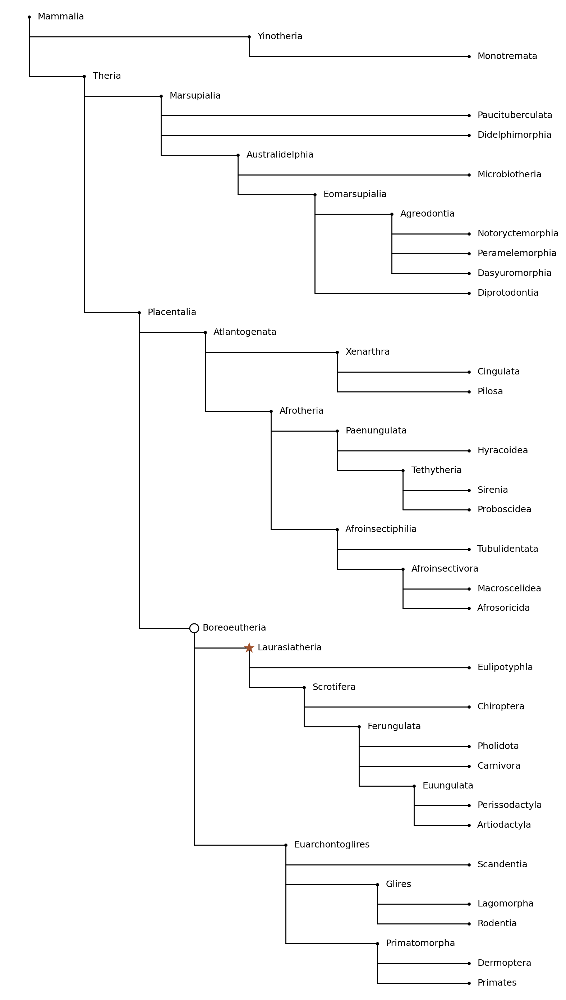
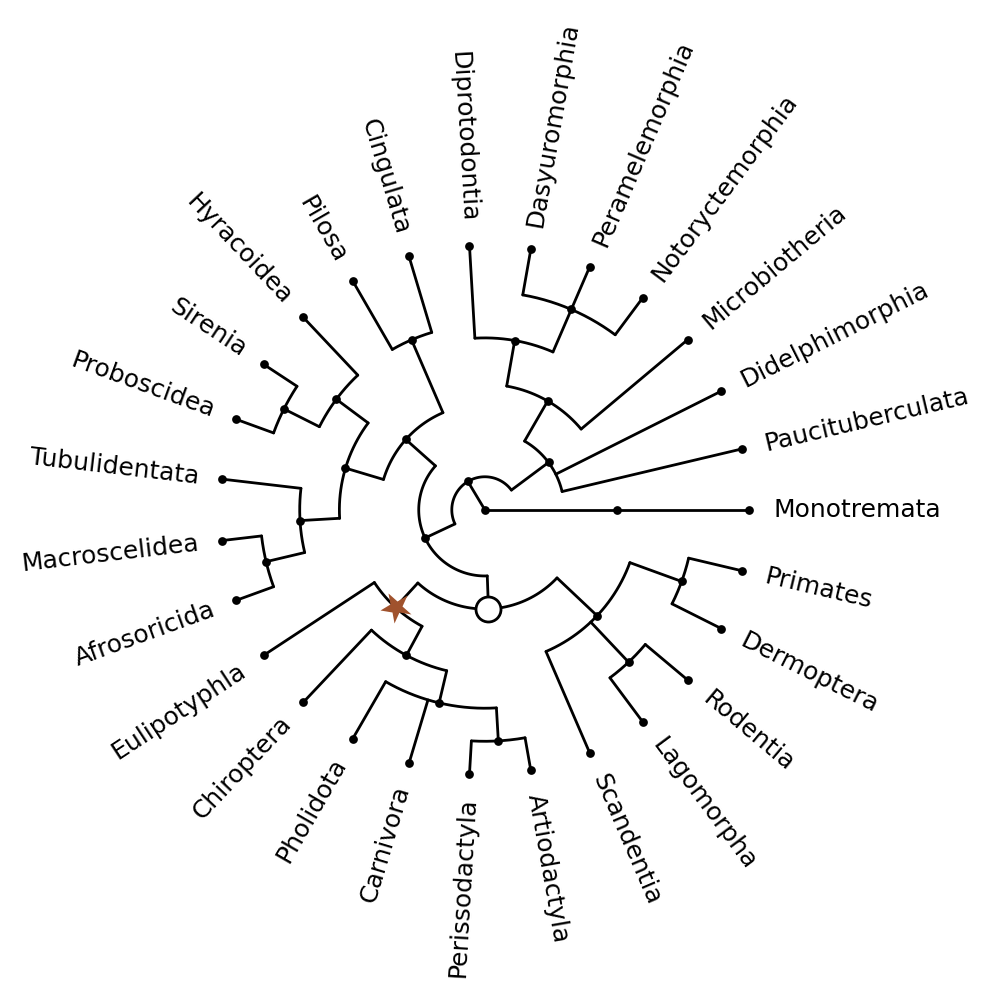
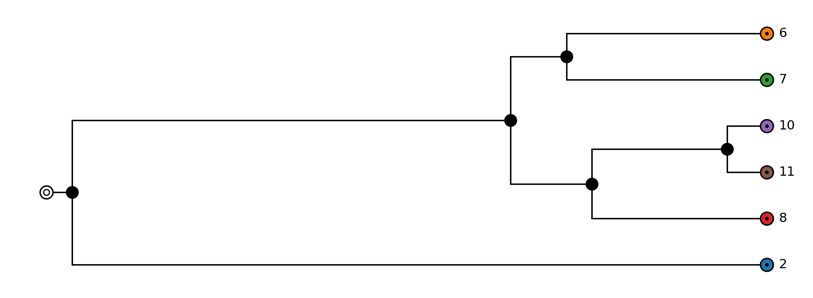
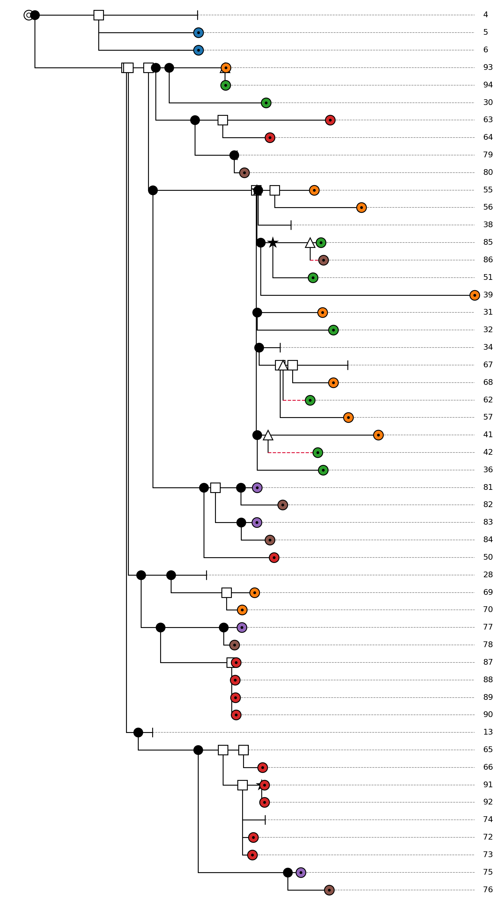

# Visualization: Examples

Two complete, self-contained examples: a real phylogeny with no branch-length data, and a
simulated dataset with rich per-node event annotations. See [Visualization](visualization.md) for
the quick start and [Layout & Styling](visualization_styling.md) for the full styling API.


## A real phylogeny: mammal classification

This example renders a mammalian classification (adapted from
[Wikipedia's mammal taxonomy](https://en.wikipedia.org/wiki/Mammal)) as a Newick string with
internal node labels but no branch lengths — a common situation for taxonomies and other
non-dated trees. It demonstrates:

- parsing a Newick tree with internal labels,
- `edge_length_mode="even"` for a clean cladogram layout when there is no meaningful branch length,
- `node_rank_mode="node"` so every internal node gets its own label row,
- highlighting a clade with a custom `style_fn` (`Laurasiatheria`), and
- highlighting a computed node with `node_overrides` — here the last common ancestor of
  `Carnivora` and `Primates`, found via [`LCA`](lca.md).

```python
from tralda.datastructures import LCA, Tree, TreeNode
from tralda.visualization.layout import LayoutMode, TreeLayout
from tralda.visualization.matplotlib_renderer import MatplotlibRenderer
from tralda.visualization.style import NodeStyle, TreeStyle

MAMMALS_NEWICK = (
    "((Monotremata)Yinotheria,((Paucituberculata,Didelphimorphia,(Microbiotheria,"
    "((Notoryctemorphia,Peramelemorphia,Dasyuromorphia)Agreodontia,Diprotodontia)Eomarsupialia)"
    "Australidelphia)Marsupialia,(((Cingulata,Pilosa)Xenarthra,((Hyracoidea,(Sirenia,Proboscidea)"
    "Tethytheria)Paenungulata,(Tubulidentata,(Macroscelidea,Afrosoricida)Afroinsectivora)"
    "Afroinsectiphilia)Afrotheria)Atlantogenata,((Eulipotyphla,(Chiroptera,(Pholidota,Carnivora,"
    "(Perissodactyla,Artiodactyla)Euungulata)Ferungulata)Scrotifera)Laurasiatheria,(Scandentia,"
    "(Lagomorpha,Rodentia)Glires,(Dermoptera,Primates)Primatomorpha)Euarchontoglires)"
    "Boreoeutheria)Placentalia)Theria)Mammalia;"
)

T = Tree.parse_newick(MAMMALS_NEWICK)
lca = LCA(T)


def style_fn(node: TreeNode, _mode: LayoutMode) -> NodeStyle | None:
    ns = NodeStyle()
    if node.label == "Laurasiatheria":
        ns.symbol = "star"
        ns.symbol_color = "sienna"
        ns.symbol_edge_color = "none"
    return ns


lca_node = lca("Carnivora", "Primates")
node_overrides = {
    lca_node: NodeStyle(symbol="circle", symbol_color="white", symbol_edge_color="black"),
}

tree_style = TreeStyle(style_fn=style_fn, node_overrides=node_overrides, node_symbol="dot")

layout = TreeLayout(T, edge_length_mode="even", layout_mode="horizontal", node_rank_mode="node")
fig, ax = MatplotlibRenderer(layout, tree_style=tree_style, show_internal_labels=True).render()
fig.savefig("mammals.png", dpi=200)
```



The same layout and style render equally well as a circular tree — just switch `layout_mode`
(here with `node_rank_mode="mean"` so leaves are spaced evenly around the circle without a
separate slot for every internal node):

```python
layout = TreeLayout(T, edge_length_mode="even", layout_mode="circular", node_rank_mode="mean")
fig, ax = MatplotlibRenderer(layout, tree_style=tree_style).render()
```




## A simulated dataset: AsymmeTree species and gene trees

[AsymmeTree](https://github.com/david-schaller/AsymmeTree) is a separate Python package for
simulating species trees and gene family histories (duplication, loss, horizontal gene transfer,
gene conversion). It is **not** a dependency of `tralda`; install it separately
(`pip install asymmetree`) if you want to reproduce this example.

Simulated trees are ordinary `tralda` `Tree`/`TreeNode` instances annotated with extra attributes
— here an `event` attribute (`"S"` speciation, `"D"` duplication, `"H"` horizontal transfer,
`"GC"` gene conversion, `"L"` loss) and, on gene-tree leaves, a `reconc` attribute naming the
species they belong to. This is a good illustration of styling based on arbitrary node attributes
with a custom `style_fn`, since there's no single "leaf vs. internal" rule: an extant gene is a
leaf styled like a filled dot, but a *lost* gene is also a leaf, styled instead as a small cap
marking where the lineage ends.

```python
from __future__ import annotations

from typing import Callable

import asymmetree.treeevolve as te

from tralda.datastructures import TreeNode
from tralda.visualization.layout import LayoutMode, TreeLayout
from tralda.visualization.matplotlib_renderer import MatplotlibRenderer
from tralda.visualization.style import NodeStyle, TreeStyle


def style_fn(color_map: dict) -> Callable:
    """Map asymmetree 'event' node attributes to a NodeStyle.
    
    Args:
        color_map: A mapping from node labels to colors.

    Returns:
        A function that maps a `TreeNode` and `LayoutMode` to a `NodeStyle` based on the node's
        event and the provided color map.
    """

    def _style_fn(node: TreeNode, _mode: LayoutMode) -> NodeStyle | None:
        ns = NodeStyle()
        event = getattr(node, "event", None)

        if node.is_leaf() and event != "L":  # extant leaf
            ns.symbol = "circle-dot"
            ns.symbol_color = color_map.get(node.label, "white")
        elif node.parent is None:  # root
            ns.symbol = "circle-inner-ring"
            ns.symbol_color = "white"
        elif event == "S":  # internal speciation
            ns.symbol = "circle"
            ns.symbol_color = "black"
            ns.symbol_edge_color = "none"
        elif event == "D":  # duplication
            ns.symbol = "square"
        elif event == "H":  # horizontal gene transfer
            ns.symbol = "triangle-up"
        elif event == "GC":  # gene conversion
            ns.symbol = "star"
            ns.symbol_color = "black"
            ns.symbol_edge_color = "none"
        elif event == "L":  # loss
            ns.symbol = "cap"

        if getattr(node, "transferred", 0):  # highlight transfer edges
            ns.edge_color = "crimson"
            ns.edge_ls = "--"
        return ns

    # style function that has access to the color_map via closure.
    return _style_fn


# Simulate a species tree and a gene tree evolving within it (duplication, loss, HGT, gene
# conversion). See the AsymmeTree documentation for the full parameter reference.
S = te.species_tree_n_age(6, 1.0, model="BDP", innovation=True, birth_rate=1.0, death_rate=0.3)
T = te.dated_gene_tree(S, dupl_rate=1.0, loss_rate=0.5, hgt_rate=0.5, gc_rate=0.2)
te.rate_heterogeneity(T, S, inplace=True)
```

Coloring genes by the species they belong to (via `reconc`) visually ties the gene tree back to
the species tree:

```python
species_colors = {v.label: f"C{i}" for i, v in enumerate(S.leaves())}
gene_colors = {
    v.label: species_colors[v.reconc]
    for v in T.leaves()
    if getattr(v, "event", None) != "L" and hasattr(v, "reconc")
}

species_style = TreeStyle(style_fn=style_fn(species_colors))
layout_S = TreeLayout(S, edge_length_mode="attr")
fig_S, ax_S = MatplotlibRenderer(layout_S, tree_style=species_style).render()
```



```python
gene_style = TreeStyle(style_fn=style_fn(gene_colors), default=NodeStyle(symbol_size=11))
# node_rank_mode="node" keeps every duplication/loss/transfer event on its own row.
layout_T = TreeLayout(T, edge_length_mode="attr", node_rank_mode="node")
fig_T, ax_T = MatplotlibRenderer(layout_T, tree_style=gene_style).render()
```



Dashed crimson edges mark horizontal-transfer branches (`transferred` attribute); square, triangle,
and star markers mark duplication, transfer, and gene-conversion events respectively; cap markers
mark gene loss.
