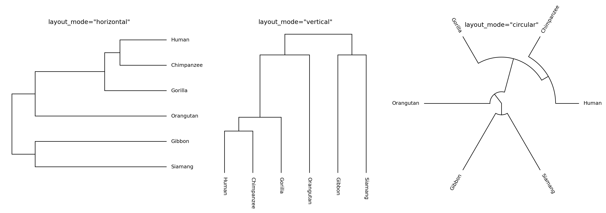
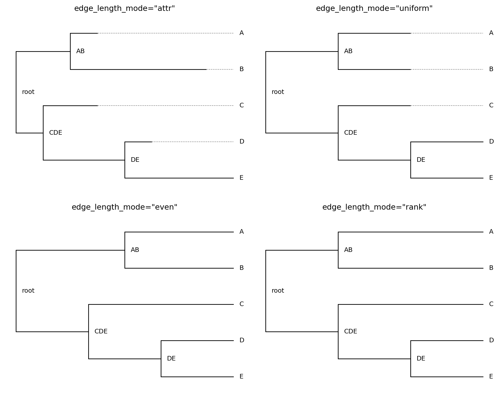
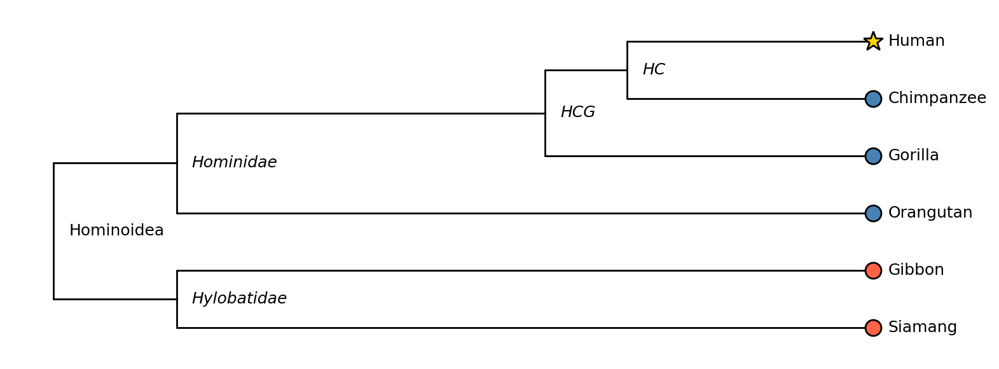
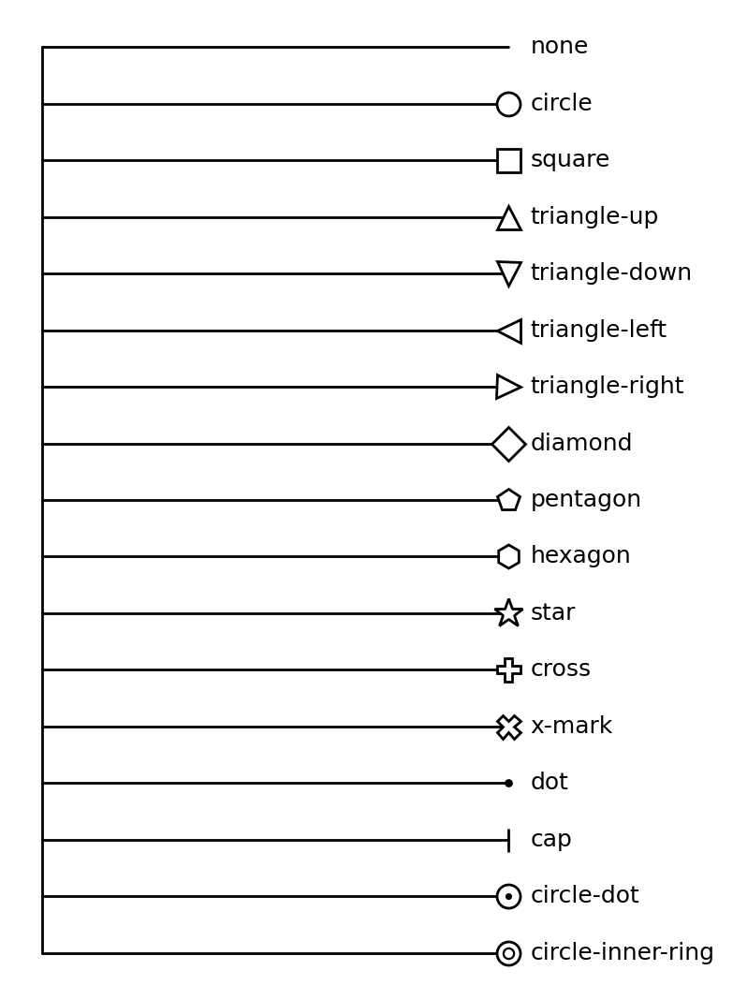

# Visualization: Layout & Styling

This page covers the full layout and styling API of `tralda.visualization`: how node positions
are computed, and how colors, symbols, and labels are resolved.  See
[Visualization](visualization.md) for installation and the one-liner `plot_tree` API, and
[Examples](visualization_examples.md) for complete end-to-end examples.


## Layout modes

[`TreeLayout`][tralda.visualization.layout.TreeLayout] computes a screen-space `(x, y)` position
for every node.  The orientation is controlled by `layout_mode`
([`LayoutMode`][tralda.visualization.layout.LayoutMode]):

- `"horizontal"` — root on the left, leaves on the right (the default).
- `"vertical"` — root at the top, leaves at the bottom.
- `"circular"` — root at the centre, leaves on the outside.

```python
from tralda.visualization.layout import TreeLayout
from tralda.visualization.matplotlib_renderer import MatplotlibRenderer

for mode in ("horizontal", "vertical", "circular"):
    layout = TreeLayout(T, layout_mode=mode)
    fig, ax = MatplotlibRenderer(layout).render()
```



A single `TreeLayout` can also be switched between modes in place with
[`compute_positions()`][tralda.visualization.layout.TreeLayout.compute_positions], without
recomputing depths:

```python
layout.compute_positions("circular")
```


## Edge-length modes

`edge_length_mode` ([`EdgeLengthMode`][tralda.visualization.layout.EdgeLengthMode]) controls how
far along the depth axis each node is placed:

- `"attr"` (default) — uses a node attribute (`edge_length_attr`, default `"dist"`) as the branch
  length. Leaves may end up at different depths if the tree isn't ultrametric.
- `"uniform"` — every edge has length 1, regardless of any `dist` attribute.
- `"even"` — cladogram style: all leaves are aligned at the same depth, with the remaining space
  distributed evenly among the edges on each root-to-leaf path. Useful for trees with no
  meaningful branch lengths (e.g. a taxonomy).
- `"rank"` — nodes are placed at their topological depth (number of edges from the root); leaves
  are then extended to the maximum depth so they align, exactly like `"even"` but based on integer
  ranks rather than continuous spacing.

When leaves end up short of the maximum depth (`"attr"` / `"uniform"`), a dashed **ghost segment**
extends them so that all leaf labels stay aligned. Ghost segments can be disabled with
`show_ghost_segments=False` on either renderer.

```python
layout = TreeLayout(T, edge_length_mode="even")
```




## Node rank modes

`node_rank_mode` ([`NodeRankMode`][tralda.visualization.layout.NodeRankMode]) controls where an
internal node sits along the axis perpendicular to depth (its "rank"), relative to its children:

- `"mean"` (default) — midpoint between the first and last child.
- `"first"` / `"last"` — aligned with the first or last child.
- `"node"` — every node (leaf *and* internal) gets its own unique rank slot. This spreads internal
  nodes out vertically/radially so that `show_internal_labels=True` never produces overlapping
  labels — useful for trees where you want to label every ancestor, as in the
  [mammal phylogeny example](visualization_examples.md#a-real-phylogeny-mammal-classification).


## Styling: `NodeStyle` and `TreeStyle`

[`NodeStyle`][tralda.visualization.style.NodeStyle] is a partial style specification: every field
defaults to `None`, meaning "inherit from the layer below". It covers three groups of fields:

- **symbol** — `symbol`, `symbol_size`, `symbol_color`, `symbol_edge_color`, `symbol_lw`, `symbol_zorder`
- **incoming edge** (from the node's parent) — `edge_color`, `edge_lw`, `edge_ls`
- **label** — `label_color`, `label_fontsize`, `label_fontweight`, `label_fontstyle`

[`TreeStyle`][tralda.visualization.style.TreeStyle] resolves a fully-specified `NodeStyle` for
every node by layering, in order (later wins):

1. **`default`** — a base `NodeStyle` applied to every node.
2. **`style_fn(node, layout_mode)`** — an optional callable returning a partial `NodeStyle`
   (or `None`) computed per node.
3. **`node_overrides`** — an optional `dict[TreeNode, NodeStyle]` for one-off, per-node tweaks,
   applied last.

```python
from tralda.visualization.style import NodeStyle, TreeStyle

def style_fn(node, layout_mode):
    if node.is_leaf():
        return NodeStyle(symbol="circle", symbol_color="steelblue")
    return None  # fall back to the default for internal nodes

tree_style = TreeStyle(
    default=NodeStyle(edge_color="grey"),
    style_fn=style_fn,
    node_overrides={some_node: NodeStyle(symbol="star", symbol_color="gold")},
)
```

Structural fallbacks — `node_symbol`, `root_symbol`, `leaf_symbol`, `internal_symbol` — supply a
symbol whenever nothing else set one, which is convenient when only some node kinds need an
explicit symbol.

### `TreeStyle.from_maps`

For the common case of "look up the symbol/color from a node attribute",
[`TreeStyle.from_maps()`][tralda.visualization.style.TreeStyle.from_maps] builds the `style_fn`
for you from plain dictionaries:

```python
tree_style = TreeStyle.from_maps(
    symbol_attr="event",
    symbol_map={"duplication": "square", "loss": "cap"},
    node_color_attr="species",
    node_color_map={"human": "steelblue", "mouse": "tomato"},
)
```

Putting all three mechanisms together — attribute-based coloring, a custom `style_fn`, and a
`node_overrides` highlight for one specific node:



```python
tree_style = TreeStyle.from_maps(
    node_color_attr="clade",
    node_color_map={"great_ape": "steelblue", "gibbon": "tomato"},
    leaf_symbol="circle",
)
tree_style.node_overrides = {
    human_node: NodeStyle(symbol="star", symbol_color="gold", symbol_edge_color="black"),
}
```


## Built-in symbols

Symbols are looked up by name in a shared cross-renderer table (`tralda.visualization._symbol_defs`).
Both renderers accept tralda's canonical names, matplotlib marker strings (e.g. `"^"`), or Plotly
marker names — whichever notation you're more used to.



`"dot"` and `"cap"` are *edge-style* symbols: they follow the incoming edge's color/width instead
of `symbol_color` — handy for lightweight event markers along a branch. `"circle-dot"` and
`"circle-inner-ring"` are *composite* symbols (an outer marker plus an inner overlay).

### Custom symbols

For the matplotlib backend, register a custom drawer globally with
[`register_symbol()`][tralda.visualization.matplotlib_renderer.register_symbol]:

```python
from tralda.visualization.matplotlib_renderer import register_symbol

def draw_flag(ax, x, y, ns, *, angle=0.0, layout_mode=None, **_):
    ax.plot(x, y, marker=(3, 0, angle), ms=ns.symbol_size, mfc=ns.symbol_color)

register_symbol("flag", draw_flag)
```

Once registered, `"flag"` is available by name to any `TreeStyle` / `NodeStyle` used with
`MatplotlibRenderer`.


## Labels

Both renderers draw a label for every node with a `label` attribute (leaves by default; pass
`show_internal_labels=True` to also label internal nodes, including the root). `show_labels=False`
suppresses leaf labels. Label placement (offset, rotation, alignment) is derived automatically
from the layout mode, including the outward-flip needed for circular labels on the left half of
the plot.


## Rescaling and figure sizing

Both renderers normalise the depth axis to `[0, 1]` by default (`rescale_depth=True`), so that
symbol and font sizes (specified in points/pixels) stay visually consistent regardless of the
unit system used for branch lengths. `MatplotlibRenderer` also derives a default `figsize` from
the leaf count and layout mode when none is given; pass `figsize=(...)` or an existing `ax` to
override it. `PlotlyRenderer` similarly derives default `width`/`height`.
